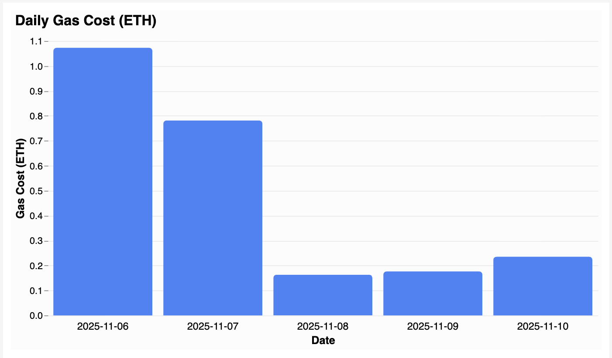
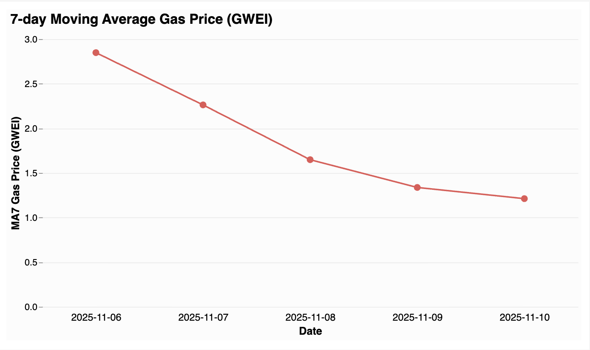
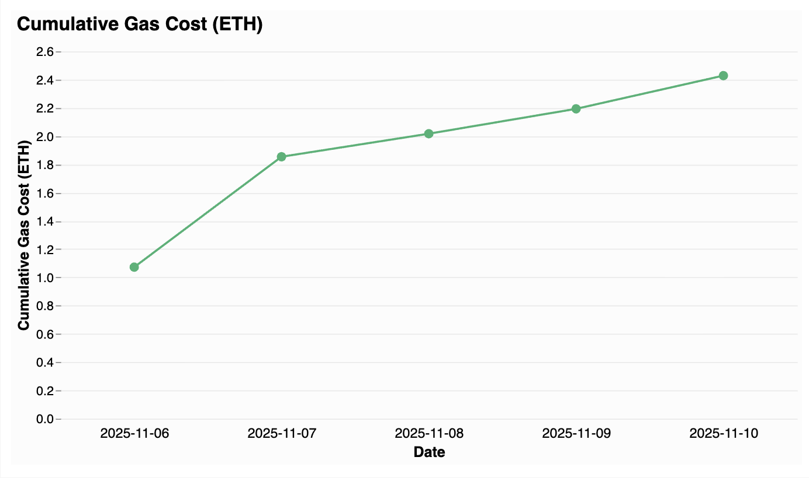

# deBridge Token Analytics 

A data pipeline for collecting and analyzing on-chain USDC transfer data for any Ethereum address.  
The system collects raw events via JSON-RPC, processes them asynchronously with Temporal workflows,  
stores analytics in ClickHouse, and exports summarized metrics as structured JSON.

### Environment

Create the environment file:

```bash
cp .env.docker.example .env.docker
```
Then edit .env.docker and replace <your-key> with your Alchemy and Infura API keys:
```b
RPC_ALCHEMY=https://eth-mainnet.g.alchemy.com/v2/<your-key>
RPC_INFURA=https://mainnet.infura.io/v3/<your-key>
```

You can provide one or both.  
For free-tier accounts it is recommended to use both:
- [Alchemy](https://www.alchemy.com/) - faster for transaction parsing
- [Infura](https://www.infura.io/) - more stable for block scanning


### Quick Start
Docker Run

Start all required services (Temporal, ClickHouse, and the application):

```bash
make up
```
  
After the first make up, wait until all containers are initialized.
  
Then run:
```bash
make up 
```

once more to ensure the application container is fully started before launching the worker.

After startup is complete, run:

```bash
make run-worker
```

This command waits for Temporal to become available and then starts the application worker inside the container.

When the worker is up, in a separate terminal run:

```bash
make run-workflow
```

The workflow will execute four activities in sequence (data collection, enrichment, aggregation, and export).
Each activity is idempotent and safely handles retries and restarts.

### Local Run (recommended for Apple Silicon)

If running on Apple Silicon (M1/M2/M3) use the local runner:

```bash
make up
make dev-run
```


This command runs both worker and workflow processes locally

### Cleanup

To stop all running containers:

```bash
make down
```
To completely remove containers, networks, and volumes:

```bash
make clean
```

### Result Export

After successful completion, analytics are exported to:

```b
.output/analytics.json
```

### Result Structure

The example below illustrates the structure of the exported analytics data file produced after successful workflow completion:

```json
{
  "address": "0x1234...abcd",
  "network": "ethereum-mainnet",
  "token": "USDC",
  "summary": {
    "events_collected": 1050,
    "blocks_scanned": [23750000, 23751000],
    "period_utc": ["2025-11-10", "2025-11-10"]
  },
  "daily_gas_cost": [
    {
      "date": "2025-11-10",
      "gas_cost_wei": "230000000000000000",
      "gas_cost_eth": 0.23
    }
  ],
  "ma7_effective_gas_price": [
    {
      "date": "2025-11-10",
      "ma7_wei": "1200000000",
      "ma7_gwei": 1.2
    }
  ],
  "cumulative_gas_cost_eth": [
    {
      "date": "2025-11-10",
      "cum_eth": 0.23
    }
  ]
}
```

### Visualization

Interactive charts were built using [Vega-Lite](https://vega.github.io/editor/)  
based on the exported analytics data. 

<sub>Click a section below to expand</sub>
<details>
<summary>🟦 Daily Gas Cost (ETH)</summary>



</details>

<details>
<summary>🟥 7-day Moving Average Gas Price (GWEI)</summary>



</details>

<details>
<summary>🟩 Cumulative Gas Cost (ETH)</summary>



</details>
